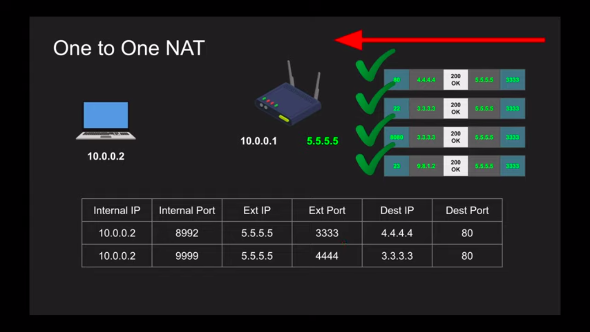
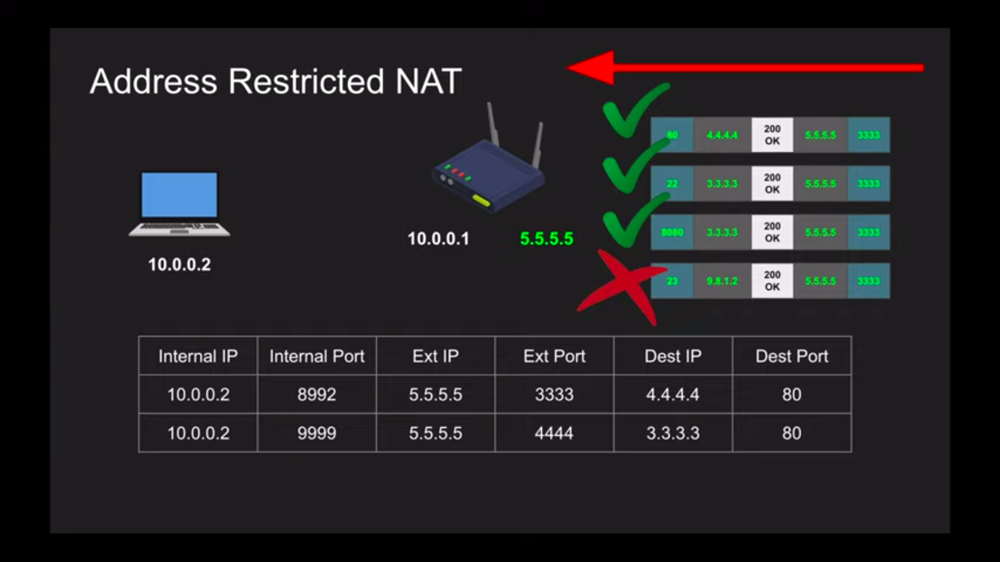
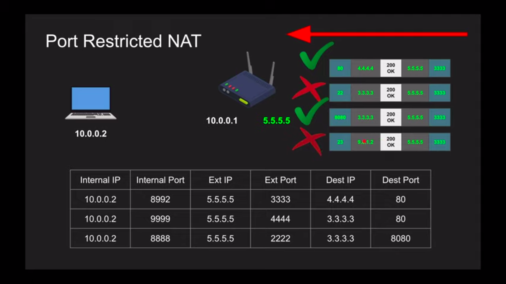
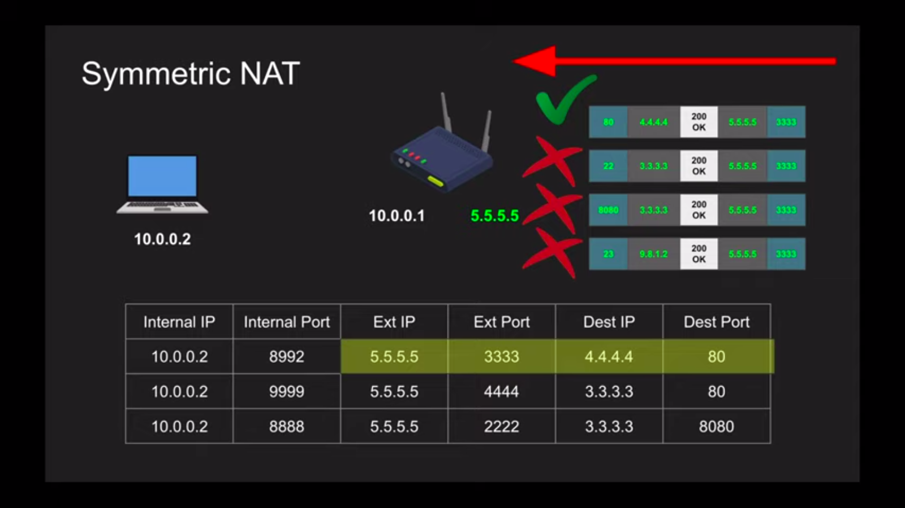

# WebRTC

```
Web Real Time Communication is a open source project that enables peer to peer connection using application programming interface.
```

## NAT

```
Network Address Translater can be define as a bridge that act as an agent from private network to other network

                            router
                            /   \
                           /     \
                    private-ip   public-ip
                    10.0.0.1      5.5.5.5
                10.0.0.2:2222 get 4.4.4.4:80
                               |
                         convert into
                5.5.5.5:3333 get 4.4.4.4:80

    Network A                                       Network B
    10.0.0.2                                        4.4.4.4:80
Network A from Port - 2222 request for Network B that has ip 4.4.4.4 and port 80
table for NAT->
    ________________________________________________________________________________
   | Internal IP |Internal Port| External IP | External Port | Dest. IP | Dest.Port |
   ----------------------------------------------------------------------------------
   |  10.0.0.2   |    2222     |   5.5.5.5   |     3333      |   4444   |    80     |
   ----------------------------------------------------------------------------------
NAT has several methods for translation ->
1. One to One NAT(Full-cone NAT) -> NAT just send packets destination to server. not check table.
2. Address restricted NAT -> NAT send packets destination to server if it exist in table.
3. Port restricted NAT -> NAT send packets to destination to server if it exist in table along with by check port.
4. Symmetric NAT ->  NAT send packets to destination to server if it exist in table along with by check both external and dest. port.
```






## Stun

> Session Traversal utilities for Nat is a set of methods. it provide public ip/port through NAT. it work for one-to-one,address restricted and port restricted method but not work for symmetric method because for symmetric connections will not able to fulfil the conditions. stun converts the private ip into public for both side than they would able communicate to each other. it is cheap to maintain.

## Turn

> Traversal Using Relays around NAT is a protocol that is used for traversal of symmetric method. it is expensive to maintain. it is a trusted server between two connections.

## ICE

> Interactive Connectivity Establishment is used to collect all the local,reflexive address, stun and turn to communicate but for the TURN case it collect public ip address for other it may establish communication directly.

## SDP

> The Session Description Protocol is a format for describing multimedia communication sessions. the SDP protocol is a declaration, by a media endpoint, of its receiving specifications and capabilities; a typical declaration would tell us:

```
. which IP Address is prepared to receive the incoming media stream
. which port number is listening for the incoming media stream
. what media type the endpoint is expecting to receive (typically audio)
. which protocol the endpoint is expecting to exchange information in (typically RTP)
. which compression encoding the endpoint is capable of decoding (codec)
```
## Signaling
> Signaling is use to Send generated  SDP to the other party. in simple it is exchange of data between networks.